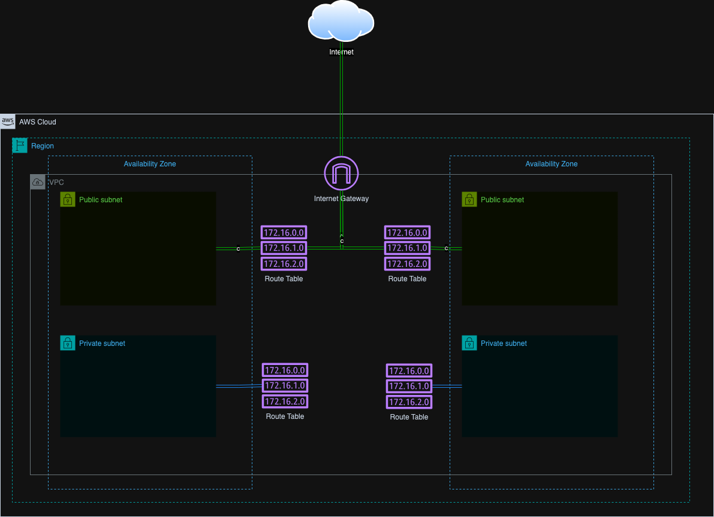

# 🚀 Amazon VPC Deployment Using Terraform 🌍

This project leverages the network account within the organization's AWS environment to provision a centralized VPC using Terraform. The VPC includes:

    Four subnets (two public and two private)
    Route tables and their respective associations
    An internet gateway linked to the public subnets

The **network account** follows the **[AWS Security Reference Architecture (AWS SRA)](https://docs.aws.amazon.com/prescriptive-guidance/latest/security-reference-architecture/welcome.html)** and serves as a dedicated space for hosting networking resources.

To support a **[multi-account environment](https://docs.aws.amazon.com/organizations/latest/userguide/orgs_introduction.html)**, the networking resources created in this account are **shared across other AWS accounts** using **AWS Resource Access Manager (RAM)**.

In this setup, the network account's resources are specifically shared with the sandbox account.

Here is a diagram of the VPC we want to build:

