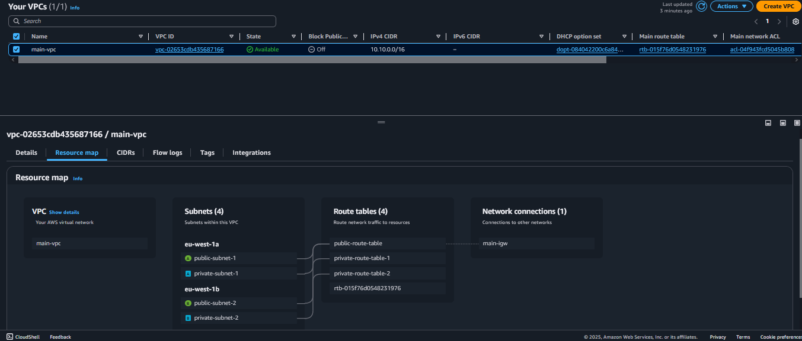
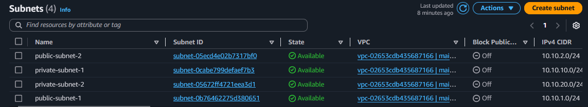
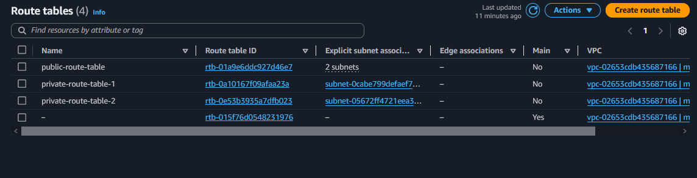
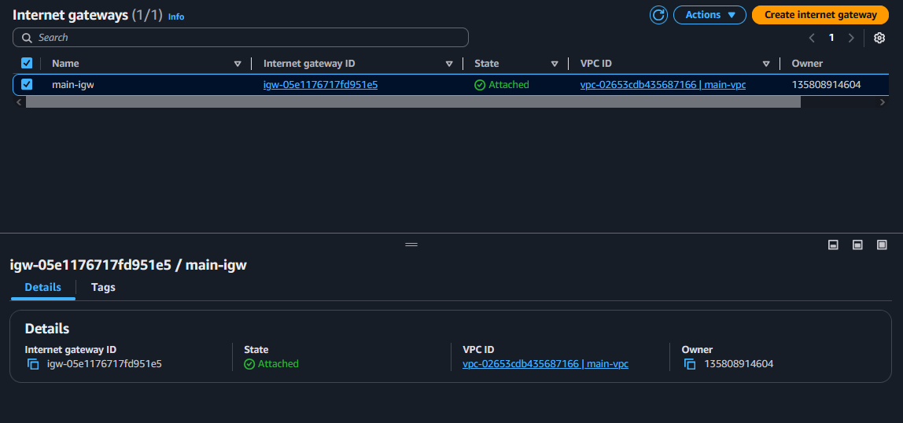
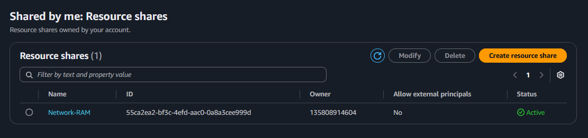
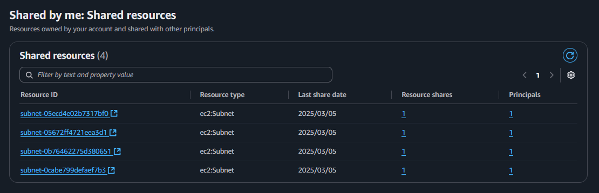
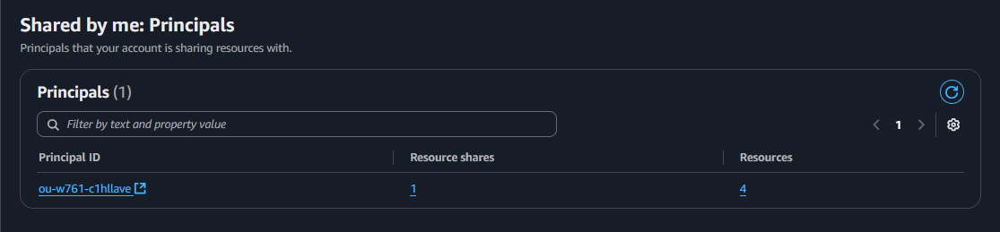

# 🚀 Amazon VPC Deployment Using Terraform 🌍

This project leverages the network account within the organization's AWS environment to provision a centralized VPC using Terraform. The VPC includes:

    Four subnets (two public and two private)
    Route tables and their respective associations
    An internet gateway linked to the public subnets

The **network account** follows the **[AWS Security Reference Architecture (AWS SRA)](https://docs.aws.amazon.com/prescriptive-guidance/latest/security-reference-architecture/welcome.html)** and serves as a dedicated space for hosting networking resources.

To support a **[multi-account environment](https://docs.aws.amazon.com/organizations/latest/userguide/orgs_introduction.html)**, the networking resources created in this account are **shared across other AWS accounts** using **AWS Resource Access Manager (RAM)**.

In this setup, the network account's resources are specifically shared with the sandbox account.

Here is a diagram of the VPC we want to build:

**Region: eu-west-1**

**VPC**

**Subnets**

**Route Tables**

**Internet Gateway**

# AWS Resource Access Manager (AWS RAM)

AWS RAM (Resource Access Manager) is a service that allows you to securely share AWS resources across multiple AWS accounts. You can share resources:
✔ Within your organization
✔ With specific organizational units (OUs)
✔ With IAM roles and users (for supported resource types)
🔹 Why Use AWS RAM?

AWS RAM helps simplify resource sharing while maintaining security and control. 

**Here are its Key Benefits:**

✅ Reduces Operational Overhead – No need to duplicate resources in each AWS account. You can manage everything centrally.

✅ Enhances Security & Consistency – Ensures resources are shared securely and follow organizational policies.

✅ Improves Visibility & Auditing – Provides tracking and logging for resource sharing, helping with compliance.

# How resource sharing works

**Resource Access Manager**

**Resource Share**

Resource sharing has already been enabled at the organisational level. Here, we share it only within an OU.

**Principal**

